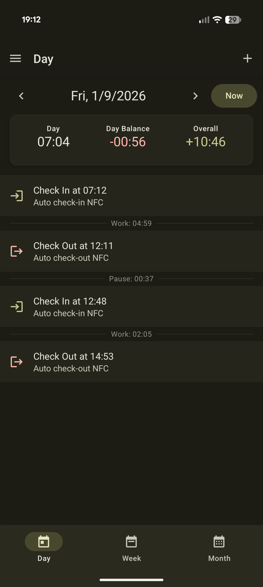
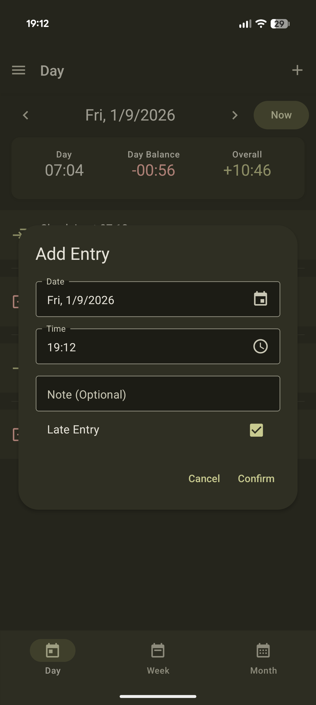
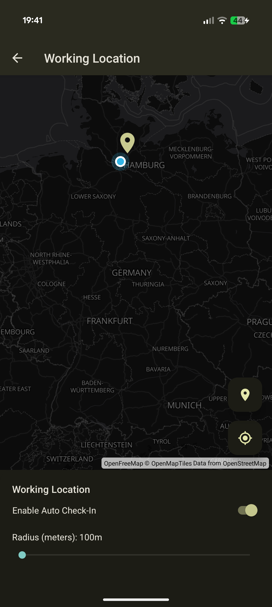
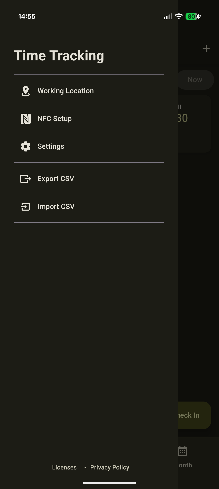
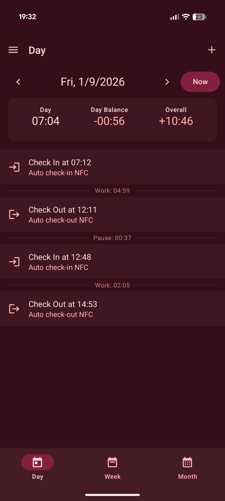

# Time Tracking App

## Features 🚀

### ⏱️ Effortless Time Tracking

Keep track of your working hours with precision and ease.

- **Manual Entry**: Add, edit, or remove time entries with custom notes.
- **Visual Overview**: Switch between Day, Week, and Month views to analyze your productivity.
- **Smart Logic**: Automatically calculates duration and keeps your records organized.

<div style="display: flex; gap: 10px;">
  
  
</div>

### 📍 Smart Auto Check-in

Forget about manual clocking. Let your phone do it for you.

- **GPS Geofencing**: Automatically clock in when you arrive at work and clock out when you leave. You'll receive a notification confirming your status.
- **NFC Tag Support**: Check in with a simple tap. Scan an NFC tag to instantly toggle your status—perfect for quick check-ins without manually opening the app.
    - _How it works_: Tapping the tag triggers a deep link that updates your status and confirms with a quick notification.

<div style="display: flex; gap: 10px;">
  
  
</div>

### 📂 Data Freedom

Your data belongs to you.

- **CSV Export**: Generate comprehensive reports of your work history in standard CSV format, ready for Excel or Google Sheets.
- **Easy Import**: Migrate your data or restore backups seamlessly via CSV.



### 🎨 Adaptive UI Integration

A user interface that feels right at home on your device.

- **Dark & Light Mode**: Seamlessly switches between light and dark themes based on your system settings or manual preference.
- **Material You**: Supports Android's dynamic color system, adapting the app's color palette to match your wallpaper and system theme for a personalized look.

<div style="display: flex; gap: 10px;">
  
  
</div>

### 🌍 Multi-language Support

Use the app in your preferred language.

- **Languages**: Currently supports **English** and **German**.
- **Auto-detection**: Automatically detects your device language settings.
- **Easy Contribution**: Missing your language? Feel free to open a PR to add it!

## Getting Started

### Prerequisites

1.  **Node.js & Yarn**:
    This project uses Yarn (via Corepack). Ensure you have Node.js installed.
    Enable Corepack to use the correct Yarn version and install dependencies:

    ```bash
    corepack enable
    yarn install
    ```

2.  **Environment Variables**:
    You must create an `.env` file in the root directory of the project.
    Add the following variable with your Google Maps API Key:
    ```
    EXPO_PUBLIC_GOOGLE_MAPS_API_KEY=your_api_key_here
    ```
    You can obtain an API key from the Google Cloud Console. Make sure to enable the **Maps SDK for Android**.
    [Get an API Key for Maps SDK for Android](https://developers.google.com/maps/documentation/android-api/?hl=en_US)

## Running the App

### Using Expo Go

Expo Go allows you to run the app quickly on your device without a full build.

1.  Start the development server:
    ```bash
    yarn start
    ```
2.  Scan the QR code displayed in the terminal using the Expo Go app on your Android device (or Camera app on iOS).

### Running Locally on Android (Debug Build)

To run a native debug build on your Android device or emulator:

1.  **Enable Developer Options on your device**:
    - Go to **Settings** > **About phone**.
    - Tap **Build number** 7 times until you see the message "You are now a developer!".
2.  **Enable USB Debugging**:
    - Go to **Settings** > **System** > **Developer options**.
    - Enable **USB debugging**.
3.  Connect your device via USB.
4.  Run the app:
    ```bash
    yarn android
    ```
    This command runs `expo run:android`.

### Installing Release Version on Phone

To build and install the optimized release version on your connected Android device:

```bash
yarn android:release
```

This command runs `expo run:android --variant=release`.

## Scripts

### Running Tests

To run the unit tests using Vitest:

```bash
yarn test
```

### Type Checking

To check for TypeScript errors:

```bash
yarn typecheck
```

### Linting

To lint the codebase:

```bash
yarn lint
```

## Acknowledgments

This app was mainly created by vibe coding using [Google Antigravity](https://antigravity.google/).
